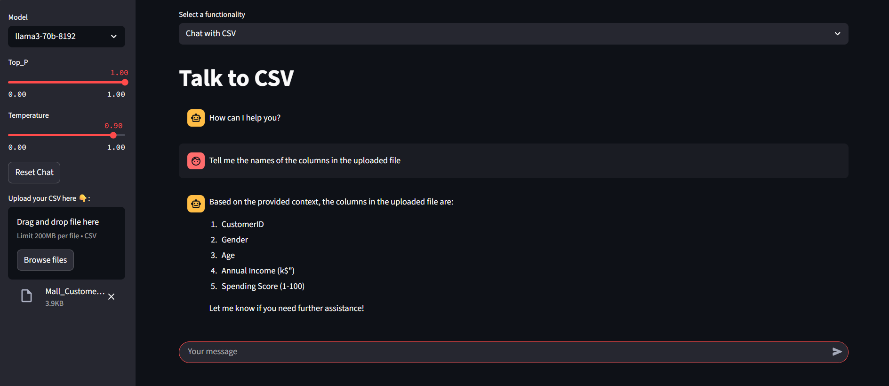

# CSV-ANALYZER 🧠

CSV-ANALYZER is the ultimate app powered by LangChain, OpenAI, and Streamlit that allows you to unlock hidden insights in your CSV files. With CSV-AI, you can effortlessly interact and summarize your CSV files in one convenient place. 

## Features

CSV-ANALYZER offers the following key features:

- **Interact:** Easily navigate through your CSV files and interact with the data.
- **Summarize:** Generate descriptive summaries for your CSV data.

## Installation

To run the CSV-ANALYZER, follow these steps:

1. Clone this repository to your local machine.
2. Navigate to the project directory.

```bash
git clone https://github.com/Safiullah-Rahu/CSV-AI.git
cd csv-ai
```
Install the required packages:

```bash
pip install -r requirements.txt
```
Run the app:
```bash
streamlit run app.py
```

## Output


##Try Live Demo
🔗 https://analyze-csv.streamlit.app/

## Feedback and Contributions
If you have any feedback, suggestions, or issues related to CSV-ANALYZER, please open an issue on the GitHub repository. Contributions are also welcome! If you would like to contribute to CSV-ANALYZER, please follow the guidelines outlined in the Contribution Guidelines.


## License
CSV-ANALYZER is licensed under the MIT License.
